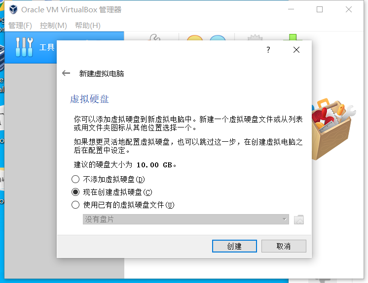
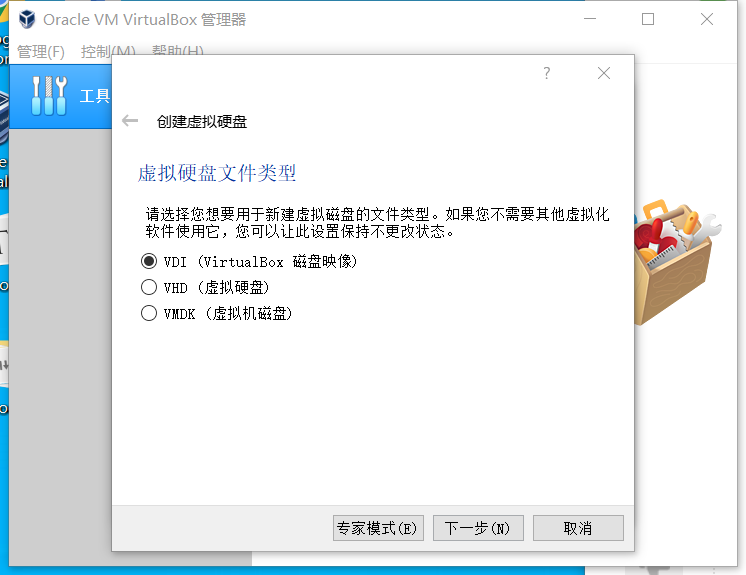
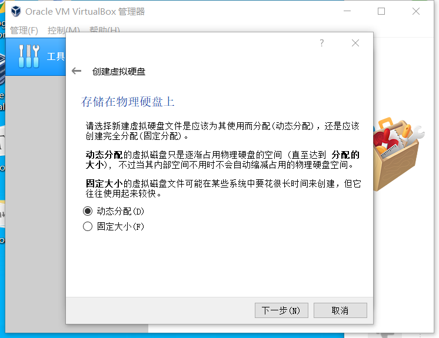
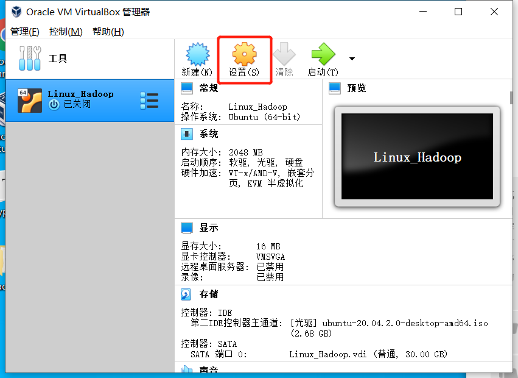
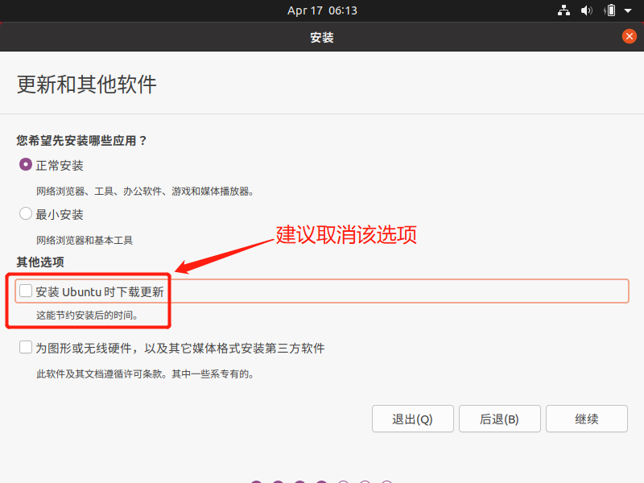
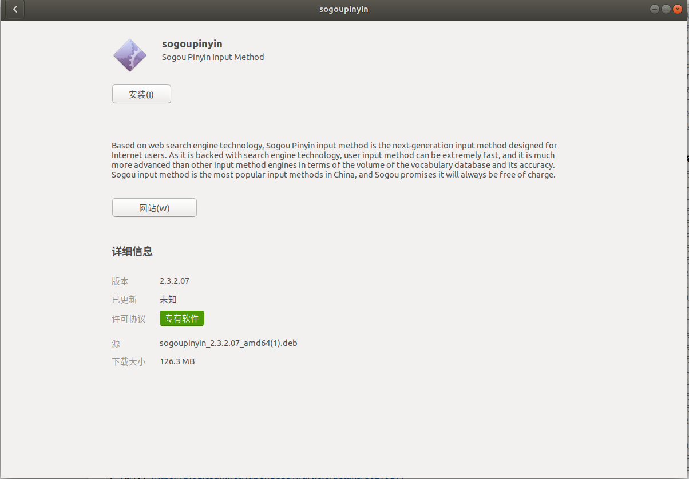
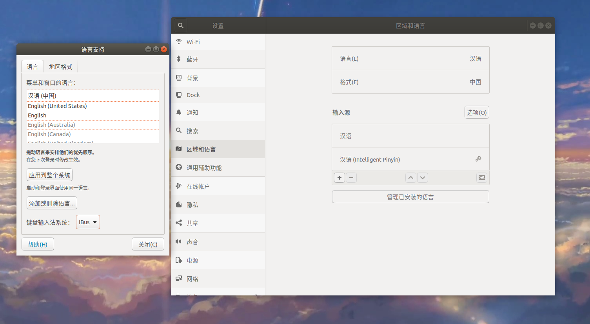

# Linux的安装

# 一、相关工具、版本简介

1. 虚拟机：Oracle VM VirtualBox
2. Ubuntu版本：20.04
3. Hadoop版本：


# 二、创建虚拟机

成功安装Oracle VM VirtualBox后，打开的页面如下：


在开始之前，我们首先要准备好Ubuntu ISO镜像文件，以便在虚拟机上安装Ubuntu操作系统。在这里我们选取的是`ubuntu-20.04.2.0-desktop-amd64.ios`。那么，具体的安装步骤，可以按照如下指引进行：

1. 新建一个虚拟机


2. 虚拟机名称和系统类型


3. 为虚拟机分配内存大小


4. 虚拟硬盘的选择



5. 虚拟硬盘文件的选择



6. 存储物理硬盘的选择



7. 虚拟机存放的位置以及虚拟硬盘的大小


8. 设置完成后的界面


# 三、Ubuntu系统的安装

1. 点击设置



2. 设置我们准备好的镜像文件


3. 上面步骤设置完成后，返回第一步的在刚刚的【设置】旁边有个【启动】。单击【启动】按钮，启动虚拟机。启动后就如下图所示，我们可以在左边看到语言选择，可以根据喜好选择系统的语言，然后单击如图所示的【安装Ubuntu】


4. Ubuntu的安装和更新，我们不建议选择如图所示的选项，这会为你自动更新系统



5. 安装类型


6. 系统分区


7. 时区选择


8. 用户名和密码的设置


9. 设置完成后，就会进入自动安装的界面

   

安装完成之后，会提示要重启虚拟机，以及需要输入一个`ENTER`进入。等以上步骤都顺利的完成之后，就会显示一个登录界面，那Ubuntu的安装就大功告成啦！


## 开源软件

# 软件安装

## deb格式

## 二进制格式

## 源码编译

# 生产效率

## 1.搜狗输入法

**1.首先安装fcitx**

在终端输入

```shell
sudo apt-get install fcitx
```


**2.进入搜狗输入法官网，选择linux版下载deb文件(ubuntu系统)**





**3.打开设置，选择区域与语言，选择管理已安装的语言，在“键盘输入法系统”选择fcitx**





**4.可能需要重启，再屏幕右上角选择搜狗输入法即可**


## 2.Terminator

terminator可以在同一个窗口分割出多个终端，每个终端都是独立的，适合大屏使用


# 开发工具

## 1.git

```shell
sudo apt-get install git
```

## 2.vim

**1.首先将vim的源码克隆下来，这里因为github可能很慢，使用码云的镜像**

```shell
git clone https://gitee.com/mirrors/vim.git
```

**2.安装gcc（有则不必安装）和各依赖库**

```shell
sudo apt-get install gcc
```

```powershell
sudo apt-get install libncurses5-dev python-dev python3-dev libatk1.0-dev libbonoboui2-dev libcairo2-dev libx11-dev libxpm-dev libxt-dev
```

**3.配置与安装**

```shell
sudo ./configure --with-features=huge --enable-multibyte --enable-rubyinterp --enable-pythoninterp --enable-python3interp --enable-luainterp --enable-cscope --enable-gui=gtk3 --enable-perlinterp --with-python-config-dir=/usr/lib/python2.7/config-x86_64-linux-gnu/ --with-python3-config-dir=/usr/lib/python3.6/config-3.6m-x86_64-linux-gnu/ --prefix=/usr/local/vim8
```

--with-features=huge：支持最大特性
--enable-rubyinterp：打开对 ruby 编写的插件的支持
--enable-pythoninterp：打开对 python 编写的插件的支持
--enable-python3interp：打开对 python3 编写的插件的支持
--enable-luainterp：打开对 lua 编写的插件的支持
--enable-perlinterp：打开对 perl 编写的插件的支持
--enable-multibyte：打开多字节支持，可以在 Vim 中输入中文
--enable-cscope：打开对cscope的支持
--enable-gui=gtk3 表示生成采用 GNOME3 风格的 gvim
--with-python-config-dir=/usr/lib/python2.7/config-x86_64-linux-gnu/ 指定 python 路径
--with-python3-config-dir=/usr/lib/python3.6/config-3.6m-x86_64-linux-gnu/ 指定 python3路径(这里可以根据自己的版本做更改)
--prefix=/usr/local/vim8：指定将要安装到的路径