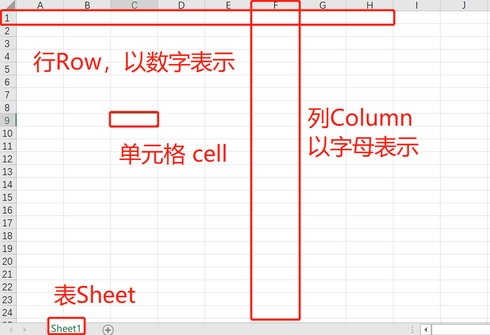

# Python自动化之Excel

方法一：应用pip执行命令

安装**openpyxl**模块`pip install openpyxl`

方法二：在Pycharm中：File->Setting->左侧Project Interpreter




### Excel读取

#### 读取对应表格

1. 打开已经存在的Excel表格

```
from openpyxl import load_workbook

exl = load_workbook(filename = 'test.xlsx')
print(exl.sheetnames)
```

2. 根据名称或去表格

```
from openpyxl import load_workbook

exl_1 = load_workbook(filename = 'test.xlsx')
print(exl_1.sheetnames)

sheet = exl_1['work']

'若只有一张表则：'
sheet = exl_1.active
```

3. 获取Excel 内容占据的大小

```
print(sheet.dimensions)
```

#### 读取单元格

1. 获取某个单元格的具体内容

```
cell = sheet.cell(row=1,column=2) #指定行列数
print(cell.value)

cell_1 = sheet['A1'] #指定坐标
print(cell_1.value)
```

2. 获取单元格对应的行、列和坐标

```
print(cell_1.row, cell_column, cell.coordinate)
```

#### 读取多个格子的值

1. 指定坐标范围

```
cells = sheet['A1:C8'] #A1到C8区域的值
```

2. 指定行的值

```
Row = sheet[1] #第1行的值
Rows = sheet[1:2] #第1到2行的值
```

3. 指定列的值

```
Column = sheet['A'] #第A列
Columns = sheet['A:C'] #第A到C列
```

4. 指定范围的值

```
# 行获取
for row in sheet.iter_rows(min_row = 1, max_row = 5,
						   min_col = 2, max_col = 6):
	print(row)
	# 一列由多个单元格组成，若需要获取每个单元格的值则循环获取即可
	for cell in row:
		print(cell.value)
		
# 列获取
for col in sheet.iter_cols(min_row = 1, max_row = 5,
						   min_col = 2, max_col = 6):
	print(col)
	
	for cell in col:
		print(cell.value)
```

#### 练习题

找出text_1.xlsx中sheet1表中空着的格子，并输出这些格子的坐标

```
from openpyxl import load_workbook

exl = load_workbood('test_1.xlsx')
sheet = exl.active
for row in sheet.iter_rows(min_row = 1, max_row = 29972,
						   min_col = 1, max_col = 10):
						   #具体查看对应表格的行列数
	for cell in row:
		if not cell.value:
			print(cell.coordinate)
```


### Excel写入

#### 写入单元格并保存

```
from openpyxl import load_workbook

exl = load_workbook(filename = 'test.xlsx')
sheet = exl.active
sheet['A1'] = 'hello word'       
#或者cell = sheet['A1'] 
#cell.value = 'hello word'
exl.save(filename = 'test.xlsx') #存入原Excel表中，若创建新文件则可命名为不同名称
```

#### 写入行数据并保存

1. 写入一行数据并保存

```
import wlwt
# 应用write中的参数，对应 行, 列, 值
sheet.write(1,0, label = 'this is test')
```

2. 写入多行数据并保存

```
#应用sheet.append()
data = [['hello',22,'hi'],
		['hell',23,'h'],
		['he',25,'him']]
for i in data:
	sheet.append(i)
exl.save(filename = 'test.xlsx')
```

#### 将公式写入单元格保存

```
sheet['A2'] = 'SUM(A1:D1)'
exl.save(filename='test.xlsx')
```

#### 插入列数据

1. 插入一列

```
sheet.insert_cols(idx=2) #idx=2第2列，第2列前插入一列
```

2. 插入多列

```
#第2列前插入5列作为举例
sheet.insert_cols(idx=2, amount=5)
```

#### 插入行数据

第2行前上面插入一行(或多行)

```
#插入一行
sheet.insert_cols(idx=2)
#插入多行
sheet.insert_cols(idx=2, amount=5)
```

#### 删除

1. 删除多列

```
sheet.delete_cols(idx=5, amount=2) #第5列前删除2列
```

2. 删除多行

```
sheet.delete_rows(idx=2, amount=5)
```

#### 移动

当数字为正即向下或向右，为负即为向上或向左

```
sheet.move_range('C5:F10', row=2, cols=-3)
```

#### Sheet表操作

1. 创建新的sheet

```
from openpyxl import load_workbook

exl = load_workbook(filename = 'test.xlsx')
print(exl.sheetnames)

exl.create_sheet('new_sheet')
```

2. 复制已有的sheet

```
exl.copy_worksheet(sheet)
```

3. 修改sheet表名

```
sheet = exl.active
sheet.title = 'newname'
```

#### 创建新的Excel表

```
from openpyxl import load_workbook

workbook = Workbook()
sheet = workbook.active
workbook.save(filename = 'new_test.xlsx')
```


### Excel 样式

#### 设置字体样式

1. 设置字体样式

   `Font(name字体名称,size大小,bold粗体,italic斜体,color颜色)`

   ```
   from openpyxl import Workbook
   from openpyxl.styles import Font
   
   workbook = Workbook()
   sheet = workbook.active
   cell = sheet['A1']
   font = Font(name='字体', sizee=10, bold=True, italic=True, color='FF0000')
   cell.font = font
   workbook.save(filename='new_test')
   ```

2. 设置多个格子的字体样式

   ```
   from openpyxl import Workbook
   from openpyxl.styles import Font
   
   workbook = Workbook()
   sheet = workbook.active
   cells = sheet[2]
   font = Font(name='字体', sizee=10, bold=True, italic=True, color='FF000000')
   for cell in cells:
   	cell.font = font
   workbook.save(filename='new_test')
   ```

#### 设置对其样式

水平对齐：`distributed, justify, center, left, fill, centerContinuous, right, general`

垂直对齐：`bottom, distributed, justify, center, top`

1. 设置单元格边框样式

`Side(style变现样式， color边线颜色)`

`Border(左右上下边线)`

```
from openpyxl import Workbook
from openpyxl.styles import Font

workbook = Workbook()
sheet = workbook.active
cell = sheet['A1']
side = Side(style='thin', color='FF000000')
#先定好side的格式
border = Border(left=side, right=side, top=side, bottom=side)
#代入边线中
cell.border = border
workbook.save(filename='new_test')
```

2. 设置单元格边框样式

变现样式：`double, mediumDashDotDot, slantDashDot, dashDotDot, dotted, hair, mediumDashed, dashed, dashDot, thin, mediumDashDot, medium, thick `

```
from openpyxl import Workbook
from openpyxl.styles import Font

workbook = Workbook()
sheet = workbook.active
cell = sheet['A1']
pattern_fill = PatternFill(fill_type='solid', fgColor 
cell1.fill = pattern_fill
#单色填充
cell2 = sheet['A3']
gradient_fill = GradientFill(stop=('FFFFFF', '99ccff','000000'))
cell2.fill = gradient_fill
#渐变填充
workbook.save(filename='new_test')
```

#### 设置行高与列宽

```
from openpyxl import Workbook 

workbook = Workbook()
sheet = workbook.active
sheet.row_dimensions[1].height = 50
sheet.column_dimensions['C'].width = 20 workbook.save(filename='new_test')
```

#### 合并、取消合并单元格

```
sheet.merge_cells('A1:B2')
sheet.merge_cells(start_row=1, start_column=3,
				  end_row=2, end_column=4)

sheet.unmerge_cells('A1:B2')
sheet.unmerge_cells(start_row=1, start_column=3,
				    end_row=2, end_column=4)
```

#### 练习题

​	打开test文件，找出文件中购买数量`buy_mount`超过5的行，并对其标红、加粗、附上边框。

```
from openpyxl import load_workbook
from openpyxl.styles import Font, Side, Border 

workbook = load_workbook('./test.xlsx') 
sheet = workbook.active
buy_mount = sheet['F'] 
row_lst = []

for cell in buy_mount:
	if isinstance(cell.value, int) and cell.value > 5: 
		print(cell.row)
		row_lst.append(cell.row)
		
side = Side(style='thin', color='FF000000')
border = Border(left=side, right=side, top=side, bottom=side) 
font = Font(bold=True, color='FF0000')
for row in row_lst:
	for cell in sheet[row]: 
		cell.font = font 
		cell.border = border
workbook.save('new_test'.xlsx')
```
